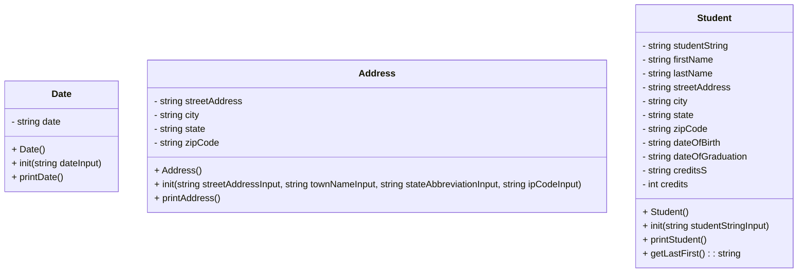

# CS121-Project-6-Heap-Of-Students



## Student::init(std::string studentStringInput)
```
put studentStringInput into studentString
clear ss and converter to make sure they are empty
put studentString into ss
use getline() with a comma delininator to give all the variables their values from the string
when we get to the credits part, instead of putting it directly into the credits variable, put it into creditsS. then put creditsS into converter, and then converter into credits. that makes it into an int
```
