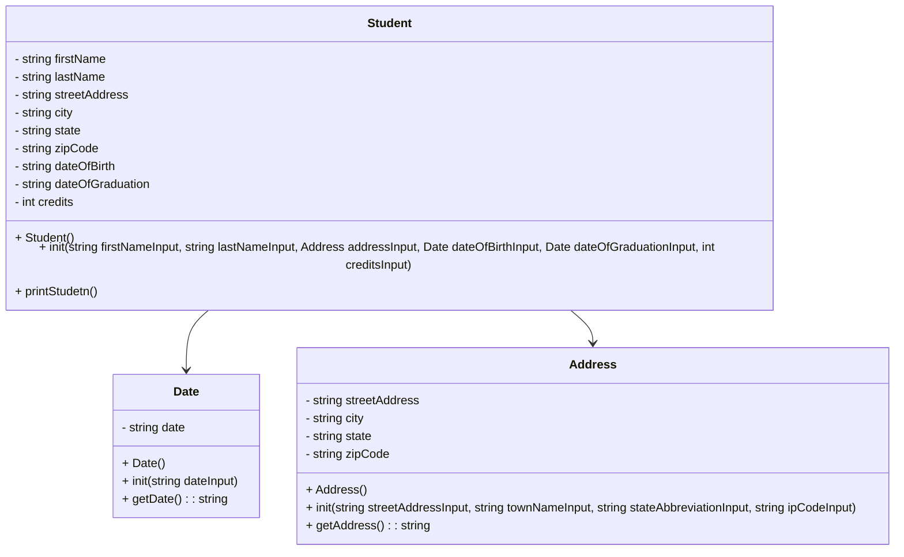

# CS121-Project-6-Heap-Of-Students

```mermaid
classDiagram

class Date {
    - string date
    + Date()
    + init(string dateInput)
    + getDate() : string
}

class Address {
    - string streetAddress
    - string city
    - string state
    - string zipCode
    + Address()
    + init(string streetAddressInput, string townNameInput, string stateAbbreviationInput, string ipCodeInput)
    + getAddress() : string
}

class Student {
    - string firstName
    - string lastName
    - string streetAddress
    - string city
    - string state
    - string zipCode
    - string dateOfBirth
    - string dateOfGraduation
    - int credits
    + Student()
    + init(string firstNameInput, string lastNameInput, Address addressInput, Date dateOfBirthInput, Date dateOfGraduationInput, int creditsInput)
    + printStudetn()
}

Student --> Date
Student --> Address
```
